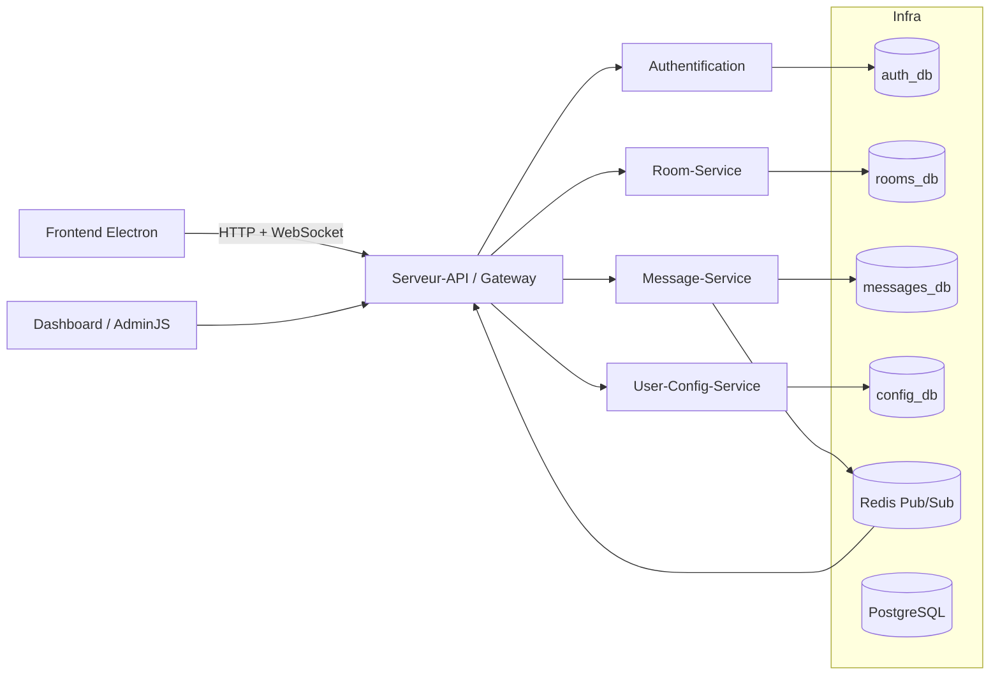

# Architecture C2

```mermaid
flowchart LR
  FE[Frontend Electron] -->|HTTP + WebSocket| API[Serveur-API / Gateway]
  DASH[Dashboard / AdminJS] --> API
  API --> AUTH[Authentification]
  API --> ROOM[Room-Service]
  API --> MSG[Message-Service]
  API --> CFG[User-Config-Service]
  AUTH --> ADB[(auth_db)]
  ROOM --> RDB[(rooms_db)]
  MSG --> MDB[(messages_db)]
  CFG --> CDB[(config_db)]
  MSG --> REDIS[(Redis Pub/Sub)]
  REDIS --> API
  subgraph Infra
    PG[(PostgreSQL)]
    REDIS
    ADB
    RDB
    MDB
    CDB
  end
```

Le Dashboard est l'application AdminJS; Infra orchestre son conteneur lorsque l'intégration de tous les repos est activée. AdminJS n'est pas une responsabilité métier d'Infra.
